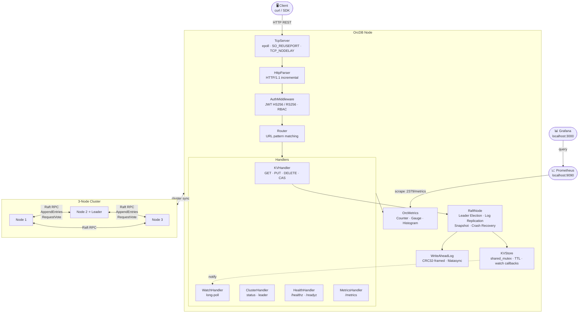

# OrcDB — Distributed Key-Value Store

A strongly-consistent, fault-tolerant distributed key-value store built in **C++20**,
implementing the **Raft consensus algorithm** and exposing a **REST HTTP API**.

Real-world use case: configuration management and service discovery for microservices —
the same problem solved by etcd and Consul in production.

---

## Architecture



### Key Components

| Layer | Files | JD Requirement |
|---|---|---|
| **Raft Consensus** | `src/raft/RaftNode.{hpp,cpp}` | Distributed Systems, HA, Fault Tolerance |
| **Replicated Log** | `src/raft/RaftLog.{hpp,cpp}` | Distributed Systems |
| **Raft RPC** | `src/raft/RaftPeer.{hpp,cpp}`, `RaftRPC.{hpp,cpp}` | TCP/IP, Socket Programming |
| **epoll TCP Server** | `src/network/TcpServer.{hpp,cpp}` | OS Multi-threading, Linux, High Performance |
| **HTTP Parser** | `src/network/HttpParser.{hpp,cpp}` | Production API, TCP/IP |
| **REST API** | `src/api/` | Production-grade API (high RPS) |
| **JWT Auth** | `src/auth/JwtValidator.{hpp,cpp}` | AuthN & AuthZ, OpenSSL |
| **RBAC** | `src/auth/AuthMiddleware.{hpp,cpp}` | AuthZ |
| **WAL** | `src/storage/WriteAheadLog.{hpp,cpp}` | Fault Tolerance, Durability |
| **KV Store** | `src/storage/KVStore.{hpp,cpp}` | High Performance, Low Latency |
| **Metrics** | `src/metrics/OrcMetrics.{hpp,cpp}` | Cloud Operational, Dashboards |
| **Thread Pool** | `src/util/ThreadPool.{hpp,cpp}` | OS Multi-threading, Concurrency |
| **Build System** | `CMakeLists.txt`, `cmake/` | Common Code Compilers |
| **Tests** | `tests/unit/`, `tests/integration/` | Unit & Integration Testing |
| **Docker + K8s** | `deploy/` | Cloud-native (AWS/GCP/OCI) |

---

## Building

**Prerequisites:** CMake 3.20+, Clang 14+ (or GCC 12+), OpenSSL dev headers, Ninja

```bash
# Install dependencies (Ubuntu 22.04)
sudo apt-get install cmake ninja-build clang-14 libssl-dev git

# Build
./scripts/build.sh

# Run tests
./scripts/test.sh
```

The first build fetches dependencies (nlohmann/json, spdlog, yaml-cpp, GoogleTest) via
CMake `FetchContent`.

---

## Running a 3-Node Cluster

### Docker Compose (local development)

```bash
cd deploy
docker-compose up --build

# Verify cluster is healthy
curl http://localhost:2379/healthz

# Get a JWT token (dev only — secret in docker-compose.yml)
TOKEN=$(./scripts/generate_jwt.sh)

# Write a key
curl -X PUT http://localhost:2379/v1/kv/service/web/host \
     -H "Authorization: Bearer $TOKEN" \
     -H "Content-Type: application/json" \
     -d '{"value": "10.0.0.1"}'

# Read it back
curl http://localhost:2379/v1/kv/service/web/host \
     -H "Authorization: Bearer $TOKEN"

# Watch for changes (long-poll)
curl "http://localhost:2379/v1/watch/service/web/host?timeout_ms=30000" \
     -H "Authorization: Bearer $TOKEN"

# Check Prometheus metrics
curl http://localhost:2379/metrics

# Open Grafana dashboard: http://localhost:3000 (admin/admin)
```

### Kubernetes (OCI / GKE / EKS)

```bash
# Create namespace + secrets
kubectl apply -f deploy/k8s/namespace.yaml
kubectl create secret generic orcdb-secrets \
    --from-literal=jwt-secret="$(openssl rand -hex 32)" \
    -n orcdb

# Deploy
kubectl apply -f deploy/k8s/

# Check status
kubectl get pods -n orcdb -w

# Port-forward for local access
kubectl port-forward svc/orcdb 2379:2379 -n orcdb
```

---

## API Reference

### Key-Value Operations

| Method | Path | Description | Role |
|--------|------|-------------|------|
| `GET`    | `/v1/kv/{key}` | Read a key | `read` |
| `PUT`    | `/v1/kv/{key}` | Write a key (body: `{"value":"...","ttl_ms":5000}`) | `write` |
| `DELETE` | `/v1/kv/{key}` | Delete a key | `write` |
| `GET`    | `/v1/kv?prefix=/svc/` | Prefix scan | `read` |
| `POST`   | `/v1/kv/{key}/cas` | Compare-and-swap | `write` |

### Watch (Long-Poll)

| Method | Path | Description |
|--------|------|-------------|
| `GET` | `/v1/watch/{key}?timeout_ms=30000` | Block until key changes |

### Cluster

| Method | Path | Description |
|--------|------|-------------|
| `GET` | `/v1/cluster/status` | Raft role, term, commit index | `read` |
| `GET` | `/v1/cluster/leader` | Current leader ID |
| `GET` | `/healthz` | Liveness probe |
| `GET` | `/readyz`  | Readiness probe (requires a leader) |
| `GET` | `/metrics` | Prometheus metrics (text/plain) |

---

## Raft Consensus

OrcDB implements the Raft algorithm (Ongaro & Ousterhout, 2014):

- **Leader election** with randomised timeouts (150–300ms)
- **Log replication** with majority quorum commits
- **Heartbeats** at 50ms intervals to suppress spurious elections
- **Log compaction** via snapshots when log exceeds 10,000 entries
- **Crash recovery** via Write-Ahead Log (CRC32-framed, `fdatasync()` after each write)
- **Fast log backtrack** using conflict term/index hints

A 3-node cluster tolerates **1 node failure** while maintaining full consistency
(writes continue as long as 2/3 nodes are reachable).

---

## Concurrency Model

| Concern | Mechanism |
|---|---|
| Leader election | Dedicated `electionThread_`; `condition_variable` reset on heartbeat |
| Log replication | Dedicated `replicationThread_`; per-peer async RPC with futures |
| State machine apply | Dedicated `applyThread_`; woken by `commitIndex` advance |
| KV store reads | `shared_mutex` (SWMR — concurrent reads, exclusive writes) |
| TCP I/O | `epoll` edge-triggered, one thread per CPU core (`SO_REUSEPORT`) |
| Thread pool | `condition_variable`-driven work queue |

---

## Performance Design

- **`SO_REUSEPORT`** — multiple threads accept independently, no lock contention on accept
- **`EPOLLET`** edge-triggered — minimal system calls per active connection
- **`TCP_NODELAY`** — disables Nagle's algorithm for sub-millisecond RPC latency
- **`shared_mutex`** on KVStore — read-dominant workloads scale linearly with reader threads
- **Pipelined Raft RPC** — up to 100 log entries per `AppendEntries` call

---

## Monitoring

Prometheus metrics exposed at `:2379/metrics`:

| Metric | Type | Description |
|---|---|---|
| `orcdb_raft_elections_total` | Counter | Leader elections started |
| `orcdb_raft_current_term` | Gauge | Current Raft term |
| `orcdb_raft_is_leader` | Gauge | 1 if this node is leader |
| `orcdb_raft_replication_latency_ms` | Histogram | AppendEntries RTT |
| `orcdb_http_requests_total` | Counter | Total HTTP requests |
| `orcdb_http_request_duration_ms` | Histogram | Request latency |
| `orcdb_kv_puts_total` | Counter | KV write operations |
| `orcdb_kv_store_size` | Gauge | Number of keys stored |

Import `monitoring/grafana/orcdb-dashboard.json` into Grafana for a 10-panel cluster dashboard.

---

## Technology Stack

| Technology | Purpose |
|---|---|
| **C++20** | Core language; uses concepts, ranges, `std::jthread` |
| **CMake 3.20 + Ninja** | Build system, `compile_commands.json` for tooling |
| **OpenSSL** | JWT HS256/RS256 signature and verification |
| **nlohmann/json** | Zero-overhead JSON for RPC serialization |
| **spdlog** | Async structured logging |
| **yaml-cpp** | Node configuration files |
| **GoogleTest + GoogleMock** | Unit and integration test framework |
| **epoll (Linux)** | O(1) async I/O, 100k+ concurrent connections |
| **Docker + K8s** | Cloud-native deployment on AWS / GCP / OCI |
| **Prometheus + Grafana** | Metrics and operational dashboards |
